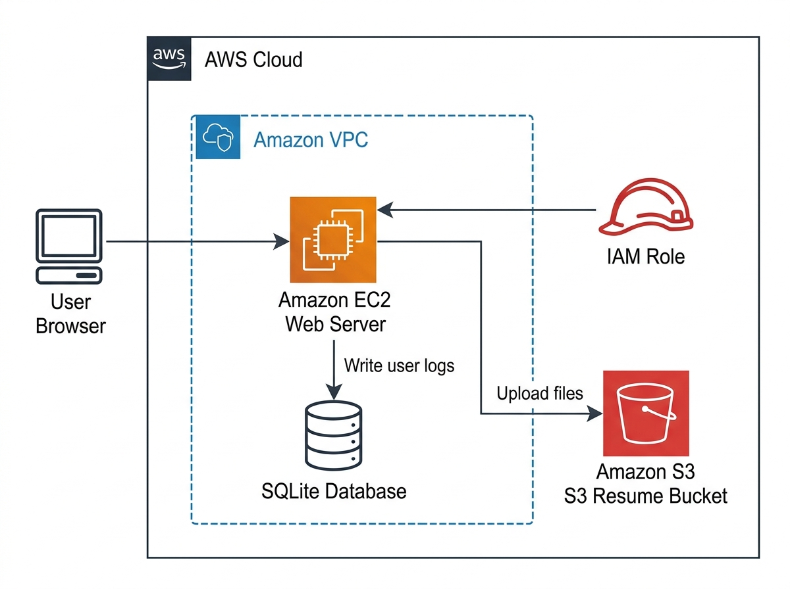
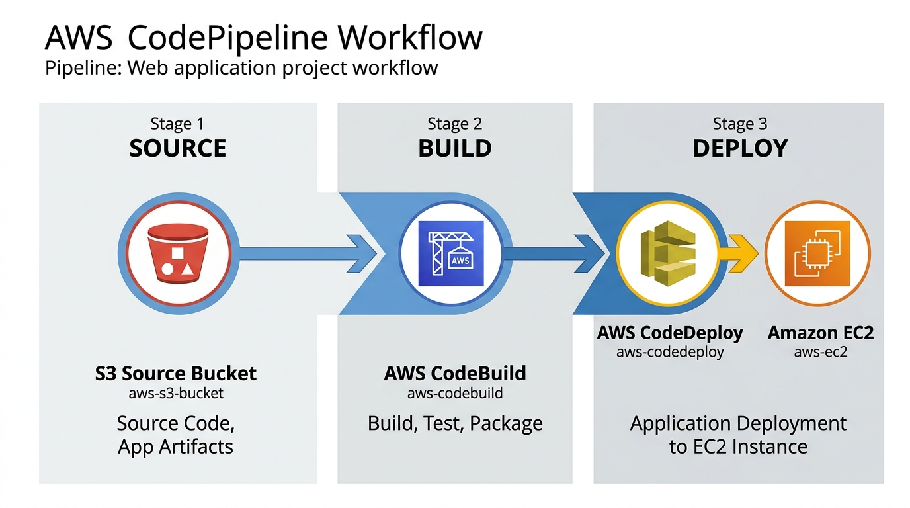
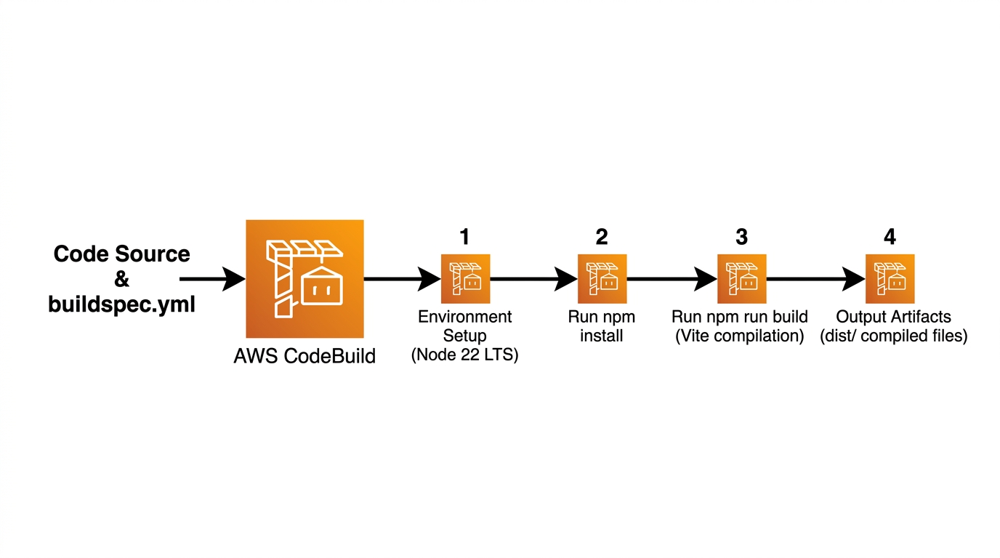
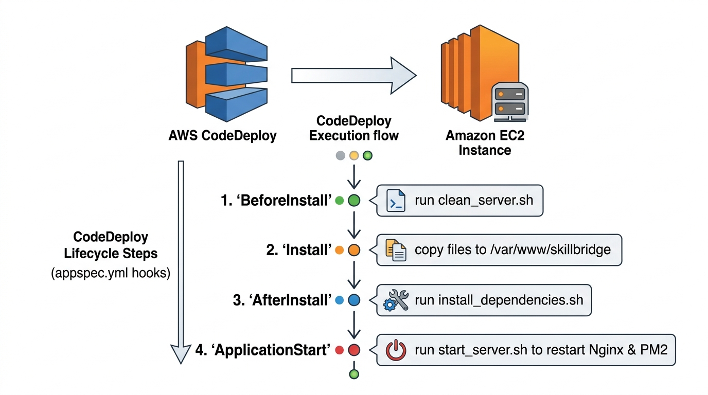

# SkillBridge: Cloud-Based Skill Gap Analysis & Placement Tracking System

SkillBridge is a modern, full-stack web application designed for engineering colleges to help students analyze skill gaps against target career roles, track placement preparation milestones, log daily coding updates, optimize resumes against keyword matching, and participate in campus leaderboards.

The application is architected to run locally or be deployed automatically on AWS using Terraform infrastructure-as-code templates and automated CI/CD pipelines (AWS CodePipeline, CodeBuild, and CodeDeploy).

---

## 🌟 Key Features

*   **Student Dashboard**: Real-time circular gauges tracking Placement Readiness Score and Target Skill Match Score, displaying missing keywords, and log trends.
*   **Skill Gap Analyzer**: Interactive checklist to inventory skills. Automatically highlights missing target skills and maps a structured roadmap (categorized by Core, Web, and DevOps requirements).
*   **Structured Daily Update (Check-ins)**: Log daily coding count, topics learned, skills improved, and reflection notes to maintain a daily consistency streak.
*   **Resume Keywords Sync**: Upload text or PDF resumes. The system parses content in real-time, extracts keywords, highlights gaps against target roles, and suggests improvements.
*   **Campus Leaderboard**: Gamified standings showing students ranked by Placement Readiness or Consistency Streaks.
*   **Admin Dashboard Portal**: Complete demographics panel tracking branch distributions, average readiness scores, and full CRUD operations to manage career roles and skill matrix requirements.
*   **AWS Cloud-Native Architecture**: Pre-configured Terraform files to launch an isolated Virtual Private Cloud (VPC), EC2 instances under an Nginx reverse-proxy, and secure AWS S3 storage buckets.

---

## 📐 System Architecture

SkillBridge is split into a decoupled frontend client and a RESTful backend server, designed for seamless hosting on cloud infrastructure.



### Database Schema (SQLite)
The relational schema comprises the following tables:
*   `users`: Manages credential hashing (bcryptjs), student demographics, target career roles, active streaks, and last active check-in dates.
*   `roles` & `skills`: Standard repositories for career profiles (e.g. SDE, DevOps) and technical competencies.
*   `role_skills`: Direct N-to-N join table mapping required skills to corresponding target roles.
*   `user_skills`: Stores acquired skills checked off by students.
*   `placement_tracker`: Accumulates total DSA counts, completed projects, certifications, and mock interviews to evaluate readiness scores.
*   `daily_updates`: Stores daily check-in logs including parsed JSON arrays for topics/skills and computed daily weights.
*   `resume_data`: Stores metadata of the last parsed resume and extracted skills strings.
*   `activity_logs`: Backs historical audit updates for streaks and campus logs.

---

## 🧮 Core Algorithms

### 1. Placement Readiness Score Formulation
The readiness score is calculated as a weighted sum out of 100 points:
*   **DSA Problems (30%)**: Solved count relative to target (300 problems).
*   **Projects (25%)**: Projects completed relative to target (3 projects).
*   **Skill Match (20%)**: Percentage overlap of student's checked skills vs. target career role requirements.
*   **Mock Interviews (15%)**: Mocks attended relative to target (3 mocks).
*   **Certifications (10%)**: Certs obtained relative to target (2 certs).

$$\text{Readiness Score} = (0.3 \times \text{DSA Pct}) + (0.25 \times \text{Projects Pct}) + (0.2 \times \text{Skill Match Pct}) + (0.15 \times \text{Mock Pct}) + (0.1 \times \text{Cert Pct})$$

### 2. Daily Check-in Activity Weight
Intensity weights for consistency logs range from 1.0 to 12.0 and are calculated dynamically on check-in:
*   **Streak Score (Max 4.0)**: Evaluated as `Math.min(streak * 0.2, 4.0)`.
*   **Activity Depth (Max 9.0)**: Evaluated as `Problems Solved (capped at 5)` + `Learning breadth (topics + skills capped at 4)`.

$$\text{Activity Weight} = \text{Streak Score} + \text{Activity Depth}$$

### 3. Resume Keyword Parsing Engine
The backend uses `multer` memory storage to capture file uploads and `pdf-parse` to extract clean text. It conducts boundary-matched case-insensitive regex checks (`\bkeyword\b`) matching skills required by the student's selected target role against the parsed content to count matching keywords and identify missing targets.

---

## 🛠️ Local Setup & Startup

### Prerequisites
*   Node.js (v18 or higher)
*   npm (v9 or higher)

### 1. Running the Express API Server
1. Navigate to the backend folder:
    ```bash
    cd backend
    ```
2. Install dependencies:
    ```bash
    npm install
    ```
3. Start the server (runs on `http://localhost:5000`):
    ```bash
    npm start
    ```

### 2. Running the Vite + React Client
1. Navigate to the frontend folder:
    ```bash
    cd frontend
    ```
2. Install dependencies:
    ```bash
    npm install
    ```
3. Boot the hot-reloading dev server:
    ```bash
    npm run dev
    ```
4. Open `http://localhost:5173` in your browser.

---

## ☁️ AWS Cloud Infrastructure & DevOps

### 1. Terraform Infrastructure Provisioning (`/terraform`)
*   `main.tf`: Configures a dedicated VPC, public subnets, route tables, internet gateways, security groups (exposing HTTP port 80, API port 5000, and SSH port 22), S3 bucket, IAM EC2 profile, and provisions an EC2 instance running Nginx.

**To deploy infrastructure:**
1. Set up your AWS credentials (`AWS_ACCESS_KEY_ID`, `AWS_SECRET_ACCESS_KEY`).
2. Navigate to directory:
    ```bash
    cd terraform
    ```
3. Initialize and plan:
    ```bash
    terraform init && terraform plan
    ```
4. Create resources:
    ```bash
    terraform apply -auto-approve
    ```

### 2. Automated CI/CD Pipelines

To achieve modern DevOps integration, the project is configured with a fully automated CI/CD pipeline using AWS developer tools:



*   `cicd/buildspec.yml`: Instructs **AWS CodeBuild** to compile Vite assets and bundle backend deployment folders.
    
    
    
*   `appspec.yml`: Configures deployment file routing and lifecycle hooks for **AWS CodeDeploy**.
    
    
    
*   `/scripts` Hooks:
    *   `install_dependencies.sh`: Configures PM2, Node runtime, Nginx reverse-proxy, and installs npm packages on the host.
    *   `stop_server.sh`: Halts active PM2 node app runners during new builds.
    *   `start_server.sh`: Reboots PM2 and loads Nginx proxy server.
